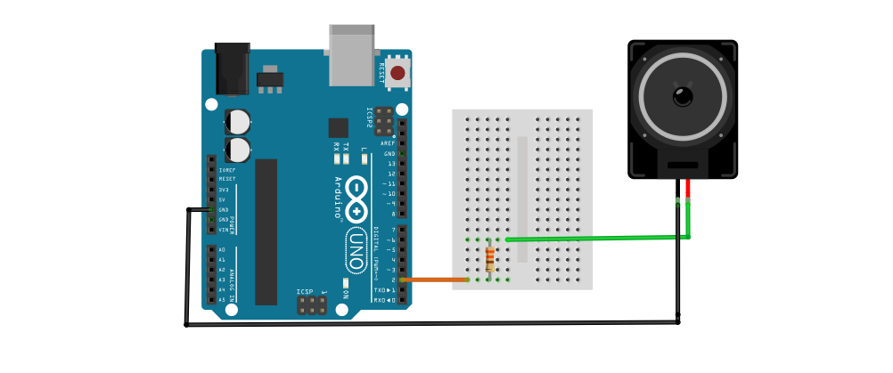
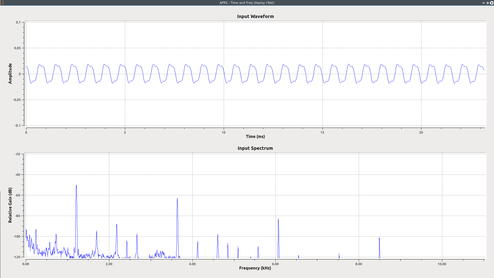
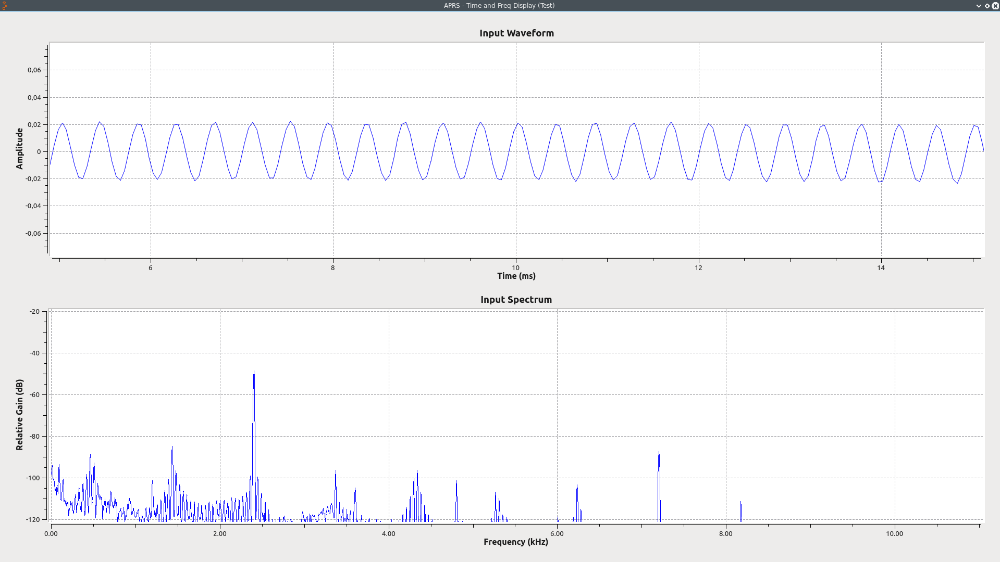
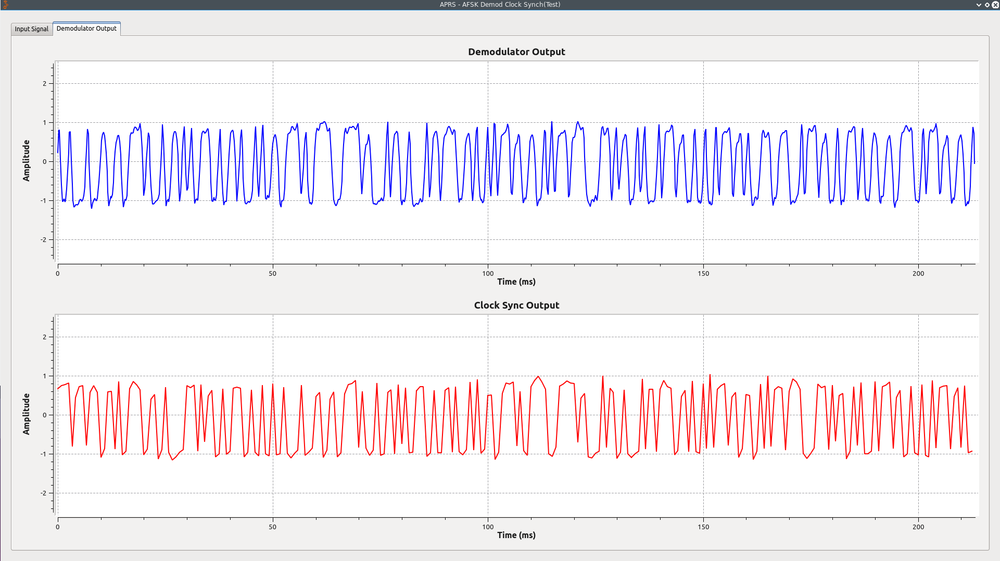
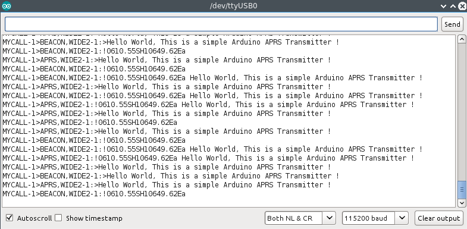
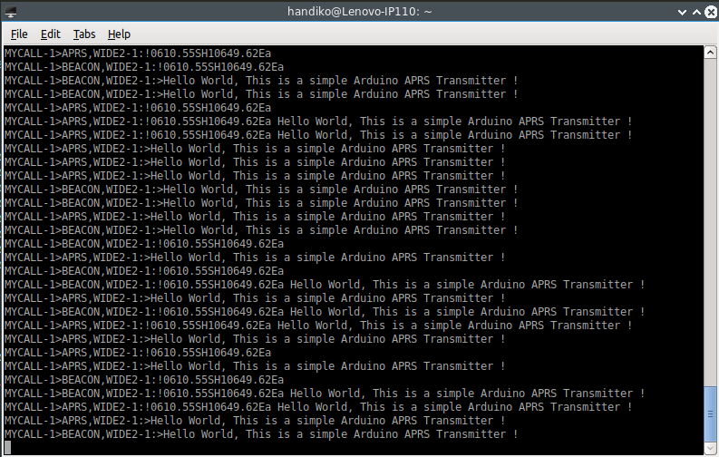
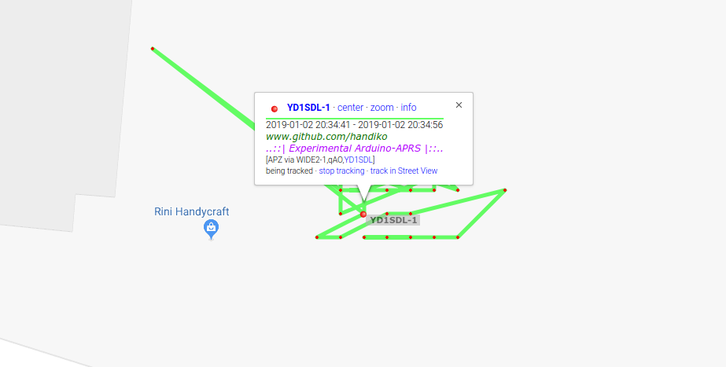
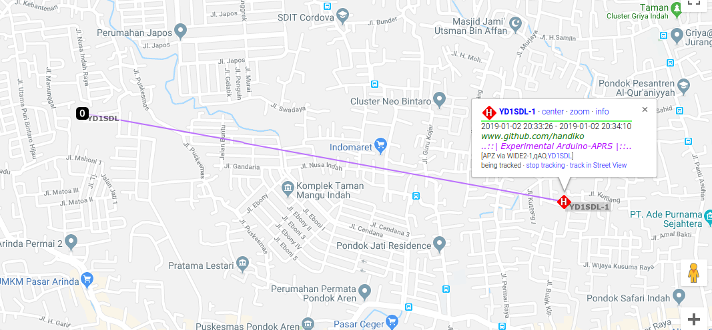
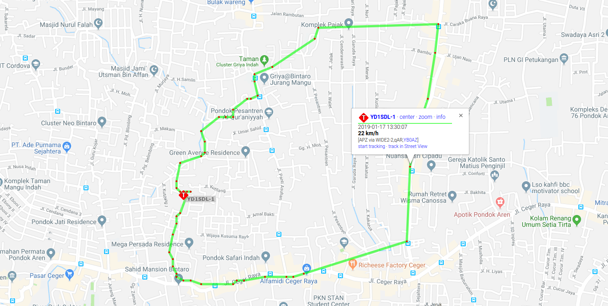
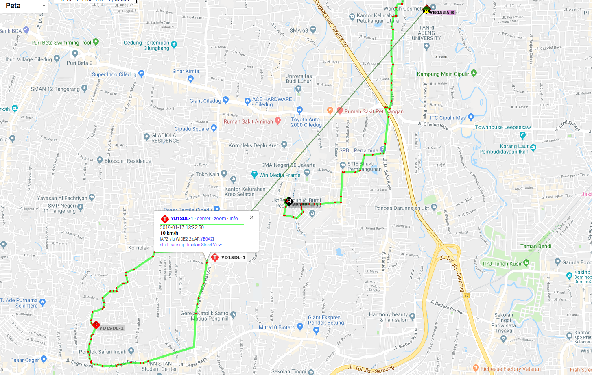

# Arduino APRS
Create simple 1200baud APRS/AFSK modulator using Arduino UNO.
Examples and Test files are included.

## Requirements
* **Arduino UNO / Compatible Board**. Doesn't really matter what board you are using. As long as it has enough GPIO and at least 1 UART to work with. Even works on ESP8266/ESP-12 board by changing the `#define OUT_PIN x` into the desired GPIO. Personally, I often use GPIO 14 on ESP8266/ESP-12, so I changed it into `#define OUT_PIN 14`.
* **Arduino IDE**
* **GNU Radio Companion** (not a mandatory, but recommended for testing purposes by running GRC flowgraph from [https://github.com/handiko/gr-APRS](https://github.com/handiko/gr-APRS)). You can also use Audacity, for spectral and time domain analysis.
* **Few resistors between 220 Ohms - 1k Ohms** (GPIO current limitter).
* **1 mini speaker** (8 Ohms - 32 Ohms and below 0.5 watt works well).
* **Jumper wires and bread board**

## AFSK Bit Banging
Basically, the technique I used to generate AFSK signal is by directly construct the signal itself by output square wave at the GPIO. Here is some code and comment snippet from the sketch (doesn't directly explain the AFSK signal generation, but I think you'll get the idea):
```c
/* SQUARE WAVE SIGNAL GENERATION
 * 
 * baud_adj lets you to adjust or fine tune overall baud rate
 * by simultaneously adjust the 1200 Hz and 2400 Hz tone,
 * so that both tone would scales synchronously.
 * adj_1200 determined the 1200 hz tone adjustment.
 * tc1200 is the half of the 1200 Hz signal periods.
 * 
 *      -------------------------                           -------
 *     |                         |                         |
 *     |                         |                         |
 *     |                         |                         |
 * ----                           -------------------------
 * 
 *     |<------ tc1200 --------->|<------ tc1200 --------->|
 *     
 * adj_2400 determined the 2400 hz tone adjustment.
 * tc2400 is the half of the 2400 Hz signal periods.
 * 
 *      ------------              ------------              -------
 *     |            |            |            |            |
 *     |            |            |            |            |            
 *     |            |            |            |            |
 * ----              ------------              ------------
 * 
 *     |<--tc2400-->|<--tc2400-->|<--tc2400-->|<--tc2400-->|
 *     
 */
 
void set_nada_1200(void)
{
  digitalWrite(OUT_PIN, HIGH);
  delayMicroseconds(tc1200);
  digitalWrite(OUT_PIN, LOW);
  delayMicroseconds(tc1200);
}

void set_nada_2400(void)
{
  digitalWrite(OUT_PIN, HIGH);
  delayMicroseconds(tc2400);
  digitalWrite(OUT_PIN, LOW);
  delayMicroseconds(tc2400);
  
  digitalWrite(OUT_PIN, HIGH);
  delayMicroseconds(tc2400);
  digitalWrite(OUT_PIN, LOW);
  delayMicroseconds(tc2400);
}

```
 
## Test
Here is some preliminary test to show you how to generate APRS (or AFSK in general) signal on Arduino UNO.
The required GRC Flowgraph can be obtained here : [GitHub page](https://github.com/handiko/gr-APRS)
* Test circuit (**bring the loudspeaker close to your laptop's microphone**, and then run the GRC flowgraph above):


### Single Tone (1200 Hz / 2400 Hz) Test
* Arduino Skecthes : **Arduino-APRS/Arduino-Sketches/Test/Single_Tone_Test_1200_Hz** (and .....2400_Hz of course)
* GRC flowgraph: **APRS_time_and_freq_disp.grc**
* Test result (1200 Hz) :

* Test result (2400 Hz) :


### Random Two Tone Test
* Arduino Skecthes : **Arduino-APRS/Arduino-Sketches/Test/Random_Two_Tones_Test**
* Test result (using **APRS_time_and_freq_disp.grc**) :

* Test result (using **APRS_time_and_freq_disp_BPF.grc**) :


### Random String Demodulation Test
* Arduino Skecthes : **Arduino-APRS/Arduino-Sketches/Test/Pulsed_AFSK_Random_Delay_with_Preamble**
* GRC Flowgraph : **APRS_AFSK_Demod_Clock_Sync.grc**
* Test result. From the plot below, demodulator output and the Clock Synchronizer output shows that the generated AFSK signal has both correct tone and correct baudrate.


## Example
Here are some examples where the generated APRS/AFSK signal is decoded using GNU Radio and [direwolf](https://github.com/wb2osz/direwolf). This example confirms that the generated APRS/AFSK signal indeed correct and decodeable.

### Mixed APRS Protocol (Normal or Beacon mode plus Fixed Position or Status Message)
* Arduino Skecthes : **Arduino-APRS/Arduino-Sketches/Example/APRS_Mixed_Message**
* GRC Flowgraph : **APRS_SCARD.grc**
* Transmitted frame (displayed in TNC2 format)

* Test Result (Demod output)

* Test Result [Direwolf](https://github.com/wb2osz/direwolf)

* Test Result (Decoded APRS Frame from GNU Radio)


## Early Static Test
Recently I performed a static test to see whether the Arduino-APRS could send the packet via Radio. Sure it could !
* Ciruits : **Arduino-APRS/Fritzing-Sketch/APRS_GPS.fzz**

* Arduino Sketches : **Arduino-APRS/Arduino-Sketches/Test/APRS_GPS_GPRMC**
* GPS : **uBlox NEO-6-M with small pacth antenna**
* I-Gate : **Direwolf** under linux
* See how it was reporting the GPS positions while it still trying to aquire the most accurate position over time ([https://aprs.fi](https://aprs.fi) , [https://aprs.fi/info/a/YD1SDL-1](https://aprs.fi/info/a/YD1SDL-1)).

* Here was the RF path to the IGate:


## Tracking Test !
I've done several tracking tests. The transmitter that I use was **Dorji DRA818V TX Shield** (for more info, please visit [GitHub page](https://handiko.github.io/Dorji-TX-Shield/) or [repo](https://github.com/handiko/Dorji-TX-Shield)) outputing only **500mW (!)** (approx., might be less), powered from a 5V powerbank, **1/4 lambda wire antenna + 1 counterpoise**, inserted into my sling bag, and I brought it when I do an evening ride. Best distance so far, I could hit the [YB0AZ](https://aprs.fi/info/a/YB0AZ) digipeater (only 4.5km, though).


Best distance to [YB0AZ](https://aprs.fi/info/a/YB0AZ)


## TODO
* Make the code more efficient and nicer. (there's a lot of room for improvement!)
* Bundle up into a library.
* Adding demodulation capability.
* Adding serial config capability.
* Tidy up this README file a bit...
* etc...

## Acknowledgements
* Direwolf - WB2OSZ [GitHub page](https://github.com/wb2osz/direwolf)
* The APRS Working Group - Tucson Amateur Packet Radio Corp
* John Hansen, W2FS - State University of New York
* Bill Newhall, KB2BRD
* [https://aprs.fi](https://aprs.fi)
* Selo - Fakultas Teknik, Universitas Gadjah Mada
* Lab. Sensor dan Sistem Telekontrol & Production House - Physics Engineering Dept, Universitas Gadjah Mada
& PT. Datto Asia Teknologi

## Contributing
1. Fork it [https://github.com/handiko/Arduino-APRS/fork](https://github.com/handiko/Arduino-APRS/fork)
2. Create new branch (`git checkout -b add-blah-blah`)
3. Do some editing / create new feature
4. Commit your works (`git commit -m "Adding some blah blah blah.."`)
5. Push to the branch (`git push -u origin add-blah-blah`)
6. Create a new Pull Request
